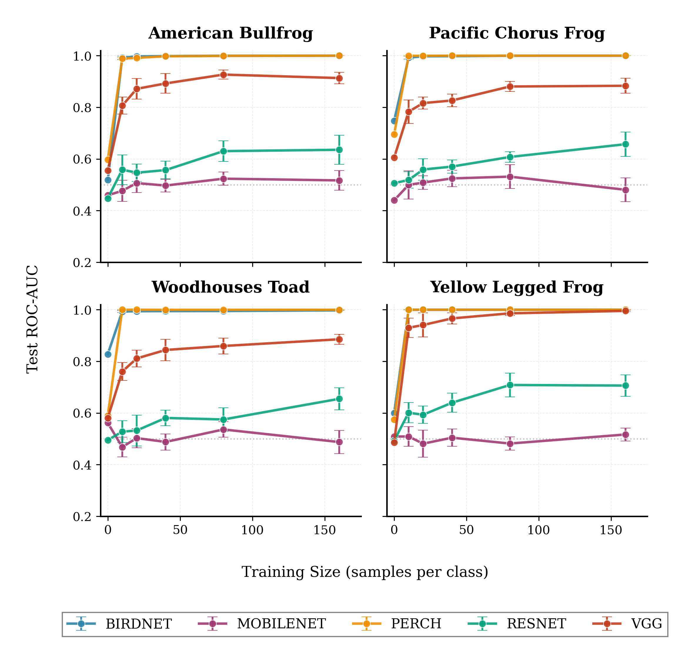
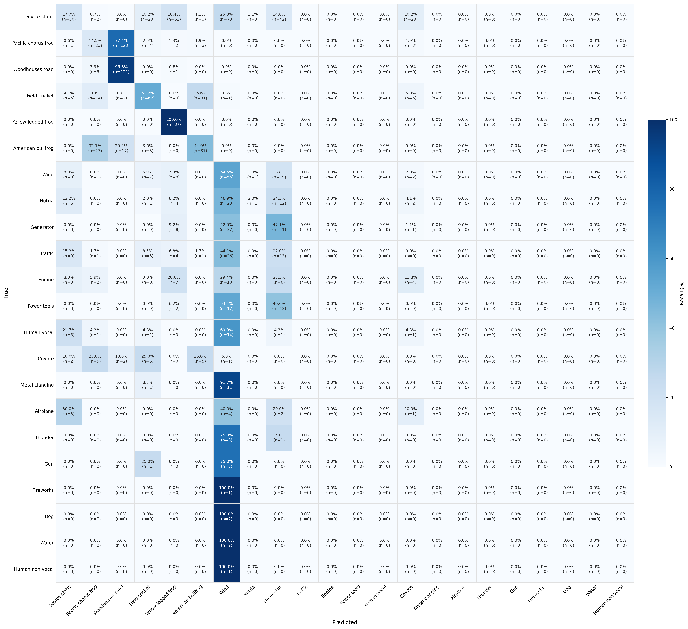
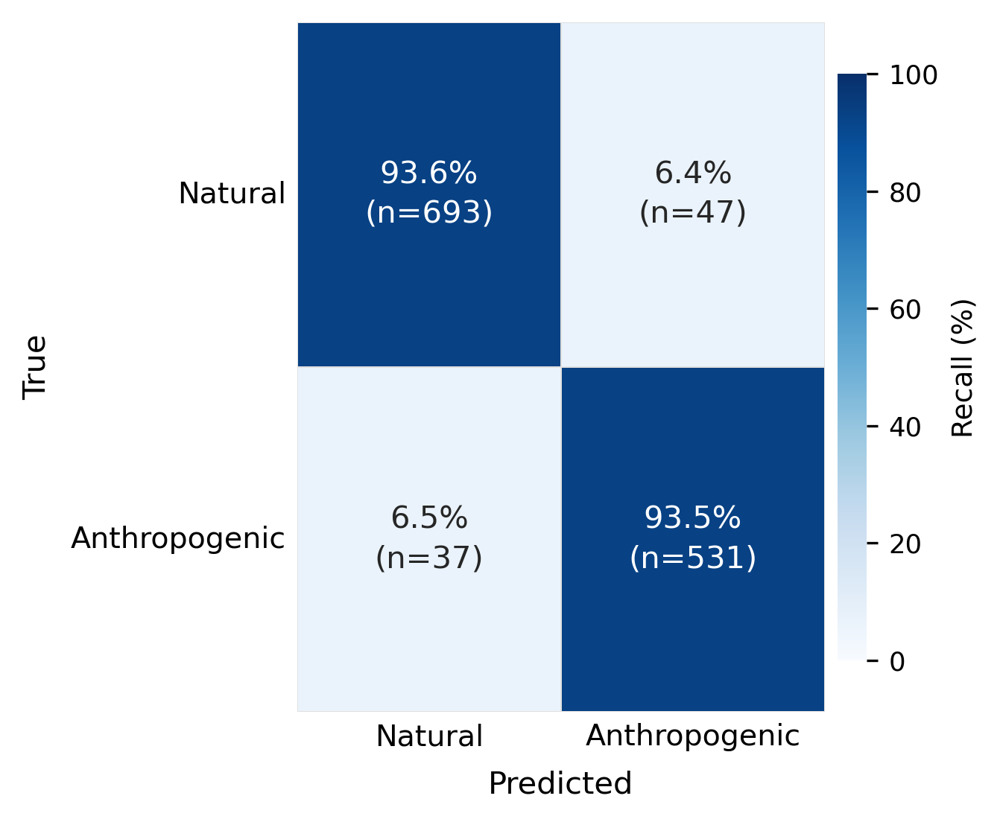

# Non-Avian ML Audio Classification

Evaluates frozen pretrained audio embeddings (BirdNET, Perch, ResNet18, MobileNetV2, VGG11) for classifying non-avian wildlife and environmental sounds. Trains lightweight MLP classifier heads across varying training set sizes to produce learning curves, then builds production-ready multiclass and binary classifiers using BirdNET embeddings.

## Experiment Overview

**Learning curve experiment** — For each species × model combination, extract frozen embeddings and train/evaluate an MLP head across multiple training sizes (10–160 samples/class) with 10 random seeds and 5-fold CV. Measures how quickly each embedding generalizes with limited data.

**Multiclass BirdNET classifier** — Single MLP trained on all species simultaneously using all available data. Outputs a per-species probability.

**Binary anthropogenic classifier** — BirdNET-based binary model distinguishing anthropogenic sounds (engines, traffic, guns, etc.) from natural sounds (frogs, wind, water, etc.).

## Models

| Model | Embedding Dim | Input |
|-------|--------------|-------|
| BirdNET 2.4 | 6522-D | 3s @ 48kHz |
| Perch 8 | 1280-D | 5s @ 32kHz |
| ResNet18 | 512-D | Mel-spectrogram |
| MobileNetV2 | 1280-D | Mel-spectrogram |
| VGG11 | 4096-D | Mel-spectrogram |

## Installation

```bash
pixi install
```

## Data Setup

Download the raw data from Zenodo (pos-only clips, no negatives):

```bash
wget https://zenodo.org/record/20534256/files/data.zip
# or
curl -L https://zenodo.org/record/20534256/files/data.zip -o data.zip
```

DOI: [10.5281/zenodo.20534256](https://doi.org/10.5281/zenodo.20534256)

Unzip into the workspace root:

```bash
unzip data.zip
```

### 1. Input structure

Place raw 3-second `.wav` clips in `pos/` for each species:

```
data/
└── {species}/
    └── data/
        └── pos/*.wav    # 3s clips @ species native sample rate
```

### 2. Build 5s clips (for Perch)

Pads each 3s clip with 1s silence on each side:

```bash
pixi run python scripts/build_data_5s.py
```

### 3. Build negatives

Balances each species by sampling negatives from other species' positives (1:1 ratio):

```bash
pixi run python scripts/build_negatives.py             # for data/
pixi run python scripts/build_negatives.py --datatype data_5s
```

After these steps, each species folder should contain:

```
data/
└── {species}/
    ├── data/
    │   ├── pos/*.wav
    │   └── neg/*.wav
    └── data_5s/
        ├── pos/*.wav
        └── neg/*.wav
```

## Running the Experiment

### Learning curve experiment

Configure `src/config.yaml`, then:

```bash
pixi run python main.py
```

Results are saved to `results/results_{species}.csv`. Generate plots:

```bash
pixi run python scripts/training_size_plots.py
```



### Multiclass BirdNET classifier

Trains a single MLP across all species using `src/config-final-classifiers.yaml`:

```bash
pixi run python scripts/train_multiclass_birdnet.py
```



### Binary anthropogenic classifier

Classifies anthropogenic vs. natural sounds using all available data:

```bash
pixi run python scripts/train_binary_anthro_birdnet.py
```



Trained classifier bundles (weights + label encoder) are saved to `results/classifiers/`.

## Citation

```bibtex
@software{non_avian_ml_2025,
  title = {Non-Avian ML Audio Classification Framework},
  author = {Van Scoyoc, Amy},
  year = {2025},
  url = {https://github.com/avanscoyoc/non-avian-ml}
}
```